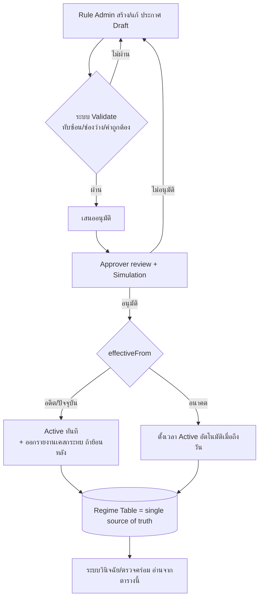
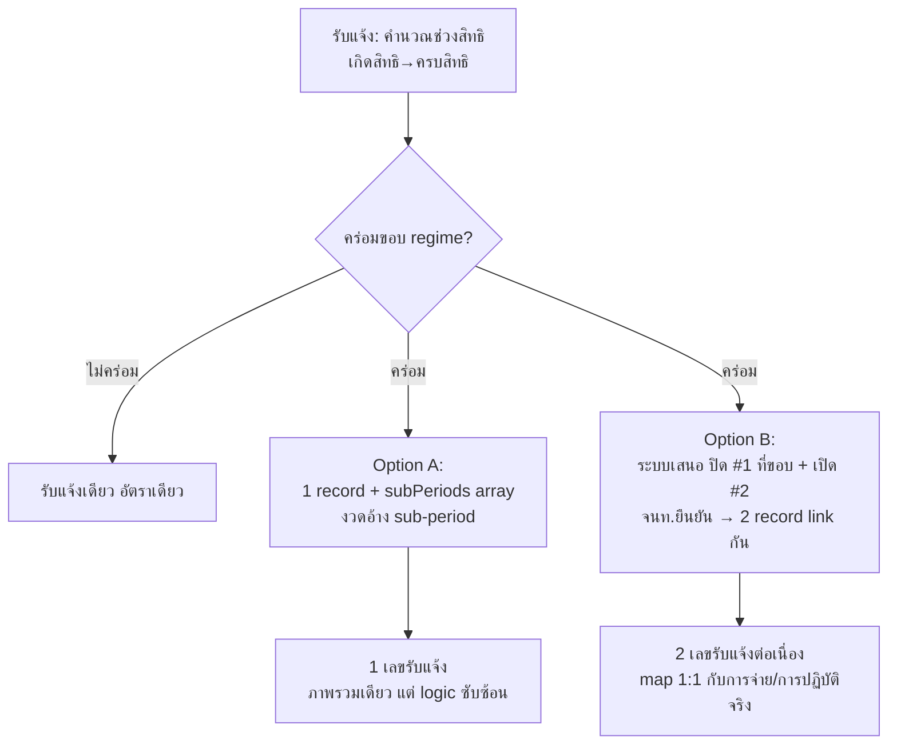

# BA Design — หน้าจอจัดการประกาศอัตรา + การออกแบบกรณีคร่อมสิทธิ

| | |
|---|---|
| **โครงการ** | BEN 33/39 — เครื่องมือวินิจฉัยประโยชน์ทดแทนกรณีว่างงาน |
| **เกี่ยวข้องกับ** | Ticket [48 | P0-3] (อัตรา พรฎ เก่า/ใหม่ + โควิด 45/70) |
| **บทบาทผู้เขียน** | Business Analyst |
| **สถานะ** | Draft เพื่อพิจารณา |

---

## บทสรุปผู้บริหาร

เสนอ 2 เรื่องที่เชื่อมกัน: (1) **หน้าจอจัดการ "ประกาศอัตรา" (Rate Regime Console)** ให้เจ้าหน้าที่ที่มีสิทธิกำหนดอัตรา/เพดาน/วันมีผลได้เอง รองรับทั้งประกาศย้อนหลังและล่วงหน้า โดยไม่ต้องแก้โค้ด และ (2) **การออกแบบกรณีคร่อมสิทธิ** ที่อ้างอิงตารางประกาศนี้ พร้อมเปรียบเทียบ 2 ทางเลือก (รับแจ้งเดียว vs แยกรับแจ้ง) ให้ตัดสินใจ

---

# ส่วนที่ 1 — หน้าจอจัดการประกาศอัตรา (Rate Regime Console)

## 1.1 ปัญหา / เหตุผล (Why)
ปัจจุบันอัตรา เพดานวัน เพดานค่าจ้าง และวันมีผล ถูกฝังในโค้ด ทุกครั้งที่มีกฎกระทรวงใหม่ (เช่น 2547 → โควิด 2563 → ฉบับที่ 2 พ.ศ.2568 → เพดาน 17,500 ปี 2569) ต้องแก้โค้ดและ deploy ทำให้ช้า เสี่ยงผิดพลาด ตรวจสอบย้อนหลังยาก และไม่รองรับการคำนวณตามประกาศที่ "มีผลย้อนหลัง" หรือ "ล่วงหน้า"

**เป้าหมาย:** ให้ตารางประกาศเป็น **single source of truth** ที่เจ้าหน้าที่จัดการได้เอง และระบบวินิจฉัย/ตรวจคร่อม อ่านจากตารางนี้

## 1.2 ผู้ใช้ & สิทธิ์ (Roles — maker/checker)

| Role | สิทธิ์ |
|---|---|
| Rule Admin (สำนักสิทธิประโยชน์) | สร้าง/แก้/เสนอประกาศ (Draft) |
| Approver (หัวหน้ากลุ่มงานกำกับฯ) | อนุมัติให้ Active (maker ≠ checker) |
| จนท.วินิจฉัย | อ่านอย่างเดียว (ระบบดึงไปคำนวณ) |
| Auditor | ดู version/log ทั้งหมด |

## 1.3 ข้อมูลในประกาศ (regime record)

วันมีผล/สิ้นสุด · อ้างอิงกฎหมาย (เลขที่ + ราชกิจจาฯ/ลิงก์) · อัตราเลิกจ้าง % + เพดานวัน · อัตราลาออก/สิ้นสุดสัญญา % + เพดานวัน · เพดานค่าจ้าง/เดือน · โควตารวม/ปีปฏิทิน (เลิกจ้างปน/ลาออกล้วน) · กฎปัดเศษ (default floor 0.05) · **`isDefault` (master flag)** · สถานะ (Draft/รออนุมัติ/Active/ยกเลิก) · เหตุผล/หมายเหตุ · audit (ผู้สร้าง/แก้/อนุมัติ + เวลา + version)

> **Master / ค่าตั้งต้น:** กฎกระทรวง พ.ศ.2547 เป็น regime ค่าตั้งต้น (`isDefault=true`, ไม่มีวันสิ้นสุด) — ช่วงเวลาใดที่ไม่มีประกาศเฉพาะครอบคลุม ระบบใช้ master นี้คำนวณอัตโนมัติ มีได้เพียง 1 master เท่านั้น

## 1.4 หน้าจอ (Screens)
1. **List / Timeline** — แสดง regime ทั้งหมดเรียงตามวันมีผล + ไฮไลต์ "ช่องว่าง/ทับซ้อน" เชิงภาพ + filter สถานะ + ปุ่มสร้าง
2. **Form** — กรอก/แก้ field + แสดงผลกระทบ
3. **Simulation (สำคัญ)** — ใส่เคสทดสอบ (วันออกงาน/สาเหตุ/ค่าจ้าง) แล้วดูผลคำนวณ **ก่อน** อนุมัติ โดยเฉพาะประกาศย้อนหลัง
4. **History / Version** — ดูเวอร์ชันเก่า + diff + rollback

## 1.5 Flow การจัดการประกาศ

- **ย้อนหลัง:** `effectiveFrom < วันนี้` → เตือน "มีผลย้อนหลัง" + ออกรายงานเคสที่วินิจฉัยไปแล้วในช่วงนั้นเพื่อทบทวน
- **ล่วงหน้า:** `effectiveFrom > วันนี้` → schedule active เมื่อถึงวัน + แจ้งเตือนล่วงหน้า
- **แก้ไข:** สร้าง version ใหม่ ไม่ทับของเดิม (effective-dated)

## 1.6 Validations (กันพังการคำนวณ)
ห้ามช่วงวันมีผล**ทับซ้อน** · **ช่วงว่างไม่ถือเป็น error** — ช่วงที่ไม่มีประกาศเฉพาะจะใช้ master (กฎ 2547) อัตโนมัติ (ต้องมี master active เสมอ จึงห้ามลบ/ปิด master จนกว่าจะมี master ใหม่) · อัตรา 0–100 · เพดานวัน/ค่าจ้าง > 0 · `effectiveTo ≥ effectiveFrom` · เตือนเมื่อแก้ regime ที่ active และมีเคสอ้างอิง · maker ≠ checker

## 1.7 เชื่อมกับกรณีคร่อม
ตารางประกาศนี้คือแหล่งที่ระบบใช้ **ตรวจจับคร่อม** (Spec A-2): เมื่อช่วงสิทธิข้าม `effectiveFrom/To` ของ regime → trigger เสนอปิด+เปิดรับแจ้ง การเพิ่ม regime อนาคต = ระบบรองรับคร่อมอัตโนมัติ **โดยไม่แก้โค้ด**

## 1.8 ข้อเสนอแนะ BA (Recommendations)
1. **Maker-checker + version + audit** — ความถูกต้องเชิงกฎหมาย
2. **Simulation sandbox ก่อน Active** — กันคำนวณผิดวงกว้าง
3. **Effective-dated (temporal) model** — ไม่ลบ/ทับของเก่า เก็บทุกเวอร์ชัน เพื่อ reproduce การวินิจฉัยในอดีตได้ตรงประกาศที่ใช้ ณ เวลานั้น
4. **ล็อก regime ที่ถูกใช้วินิจฉัยแล้วให้ immutable** — แก้ = ออกประกาศแก้ไขใหม่
5. **รายงาน "เคสกระทบ"** เมื่อประกาศย้อนหลัง
6. **Export/Import config** เผื่อ migration/DR + **แจ้งเตือนก่อน regime อนาคตมีผล**

---

# ส่วนที่ 2 — กรณีคร่อมสิทธิ: Option A (รับแจ้งเดียว) vs Option B (แยกรับแจ้ง)

## 2.1 นิยาม
- **Option A — รับแจ้งเดียว + sub-period:** 1 รับแจ้ง ภายในแตกช่วงจ่าย ≥2 อัตรา (ผูกใน record เดียว)
- **Option B — แยกรับแจ้ง (Close & Reopen):** ปิดรับแจ้ง #1 ที่ขอบกฎ → เปิดรับแจ้ง #2 ต่อเนื่อง (2 record link กัน)  *(ทางที่ตัดสินใจไว้)*

## 2.2 Flow เปรียบเทียบ

## 2.3 Pros / Cons

| มิติ | A — รับแจ้งเดียว | B — แยกรับแจ้ง *(เลือกแล้ว)* |
|---|---|---|
| สะท้อนการปฏิบัติงานจริง สปส. | ต่ำ (จริงต้องปิด/เปิด) | **สูง — ตรงแนวปฏิบัติ** |
| เลขรับแจ้ง/เอกสาร | 1 ใบ ง่ายต่อผู้ขอ | 2 ใบ ต้องอธิบายความเชื่อมโยง |
| ความซับซ้อนการคำนวณ | สูง (sub-period ใน record + งวดอ้าง sub) | **ต่ำ/ชัด (แต่ละ record อัตราเดียว)** |
| ตรรกะตรวจซ้ำซ้อน | ไม่กระทบ (1 ใบ) | ต้องกัน false-positive (#1↔#2 ต่อเนื่อง) |
| โควตา/นับวันข้ามอัตรา | อยู่ใน record เดียว ง่าย | ต้องสะสมข้าม record (`daysUsedBefore`) |
| audit / แก้ย้อนหลัง | แก้ทั้งก้อน | **แยก record ชัด ปรับเฉพาะช่วง** |
| รองรับคร่อม >2 regime | ขยาย array | เปิดรับแจ้งต่อเนื่องหลายทอด |
| งาน dev | ปานกลาง (logic + UI sub-row ใหม่) | ปานกลาง (flow ปิด/เปิด + link) |
| reconcile กับระบบจ่ายจริง | **เสี่ยงสูง** (จ่ายจริงผูกเลขรับแจ้ง) | **ต่ำ — map 1:1 กับการจ่าย** |

## 2.4 คำแนะนำ BA
**เลือก Option B** — สอดคล้องการปฏิบัติจริงและ map กับระบบจ่าย/เลขรับแจ้ง 1:1 (ตรงกับที่ผู้ใช้ตัดสินใจ)

เพื่อกลบจุดอ่อนของ B (ผู้ขอเห็น 2 ใบ) เสนอเพิ่ม **"มุมมองรวม (Consolidated View)"** บน UI ที่ผูก #1+#2 แสดงเป็นชุดเดียว → ได้ข้อดีภาพรวมเดียวของ A บนโครงสร้าง B

**ไม่แนะนำ** ให้เลือกรูปแบบราย transaction (A หรือ B สลับกัน) เพราะสร้างความไม่สอดคล้องและตรวจสอบยาก — ควร fix เป็น B ทั้งระบบ แต่ให้ตั้งค่า "รูปแบบการแสดงผล (รวม/แยก)" ได้

## 2.5 จุดที่ต้องระวัง (เชื่อม Spec)
- รับแจ้ง #2 **ไม่มี waiting 8 วันใหม่** เกิดสิทธิ = วันขอบกฎ (Spec A-4)
- โควตา/นับวัน **สะสมข้ามรับแจ้ง** ผ่าน `daysUsedBefore` (A-4, A-5)
- คู่ #1↔#2 **ห้าม** ถูก flag ความซ้ำซ้อน (A-7) — ต้องมี test กัน false-positive
- จำนวนวันสิทธิรวมขึ้นกับ regime ที่คุมส่วนที่เหลือ (เคส2=200 vs เคส4=180)
